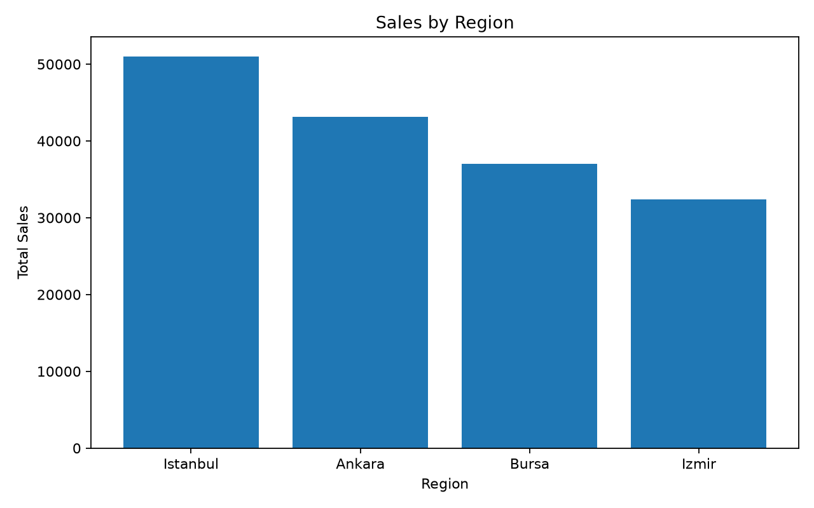

# Excel Report Generator 📊

A beginner-friendly Python project that automatically analyzes Excel data and generates summary reports and charts.

## Features

- Reads Excel data
- Calculates key metrics
- Creates region and category summaries
- Generates a new Excel report
- Creates a PNG chart

## Technologies

- Python
- pandas
- openpyxl
- matplotlib

## How to run

```bash
pip install -r requirements.txt
python report_generator.py
```

The project creates:
- `generated_report.xlsx`
- `sales_by_region.png`

## Why I built this

I created this project to practice Python automation and learn how repetitive Excel reporting tasks can be simplified with code.

## Future improvements

- Interactive dashboard
- PDF report generation
- Email delivery
- AI-generated insights
## Example Output 📊
 
The chart below is automatically generated from the sample Excel dataset.
 
